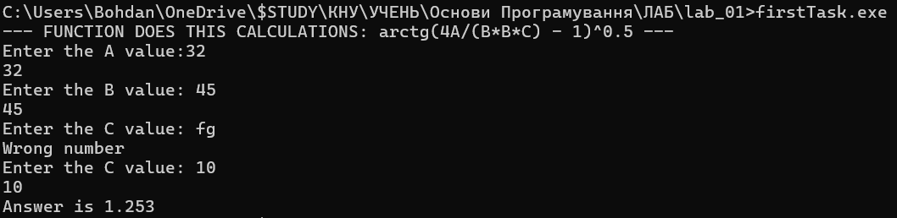
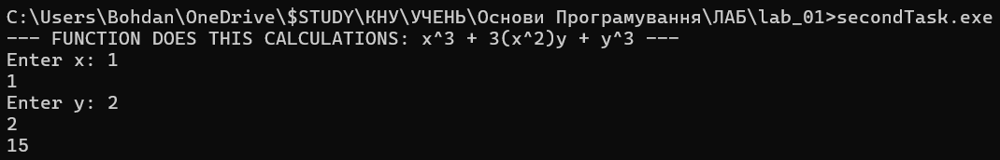
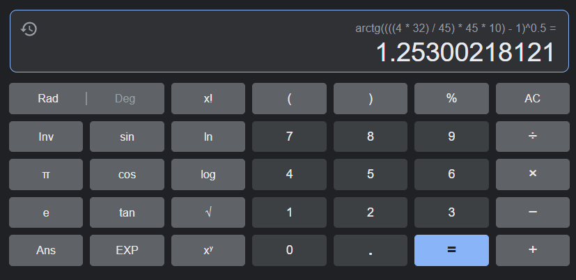
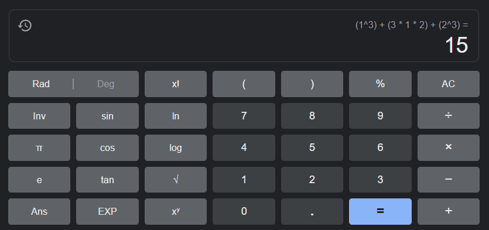

# Лабораторна робота №1

## Мета роботи

1. Вивчити особливості використання вбудованих типів даних: char, int, long, short, float, double, unsigned char, unsigned int, unsigned long.
2. Вивчити особливості використання функцій введення - виведення.
3. Навчитися застосовувати стандартні математичні функції.

## Умова задачі

### Завдання 1
  Обчислити заданий вираз при заданих користувачем значеннях параметрів A, B, C:
`√(arctg(4A/(B^2)C - 1)`

де:
- \(A\) - це введене користувачем число.
- \(B\) - це також введене користувачем число.
- \(C\) - також введене користувачем число.

### Завдання 2 
  Написати програму, що розв'язує задачу з математики та фізики шкільного курсу:
`x^3 + 3(x^2)y + y^3`

## Аналіз задачі та теоретичні обґрунтування

### Завдання 1
  Завдяки відокремленій функції `getDoubleValue`(localutils.h) запитуємо в користувача по черзі значенн трьох вище згаданих змінних(A, B, C). Ця функція також виконує перевірку на те чи введене користувачем є числом(Якщо ні - програма питає ще раз). Після присвоєння всіх значень до відповідних змінних робимо обчислення з функцією `calculationTask`(firstTask.cpp) і виводимо отримане значення в термінал. 

#### Основні етапи:
  - Введення значень \(A\), \(B\), і \(C\) від користувача завдяки створеній окремо функції `getDoubleValue`.
  - Використання функції `calculationTask` для обчислення виразу.
  - Виведення результату на екран.

Формула використовує функції `sqrt` (для обчислення кореня квадратного) та `atan` (арктангенс). Результат обчислення виводиться на екран.

Потрібно **зауважити** що при вводі будь яких символів окрім виключно **чисел**, програма не буде продовжувати, а буде перепитувати в користувача ще раз. 

### Завдання 2
  Завдяки згаданій вище функції `getDoubleValue` (localutils.h) запитуємо в користувача по черзі значення двох змінних(`x`, `y`). Ця функція також виконує перевірку на те чи введене користувачем є числом(Якщо ні - програма питає ще раз). Після присвоєння всіх значень до відповідних змінних робимо обчислення з функцією `calculationTask`(secondTask.cpp) і виводимо отримане значення в термінал. 

### Основні етапи:
  - Введення значень \(A\), \(B\), і \(C\) від користувача завдяки створеній окремо функції `getDoubleValue`.
  - Використання функції `calculationTask` для обчислення виразу.
  - Виведення результату на екран.

Формула використовує функції `sqrt` (для обчислення кореня квадратного) та `atan` (арктангенс). Результат обчислення виводиться на екран.

Потрібно **зауважити** що при вводі будь яких символів окрім виключно **чисел**, програма не буде продовжувати, а буде перепитувати в користувача ще раз. 


## Алгоритм у вигляді блок-схеми
Ось вище описаний алгоритм у вигляді блок-схеми

### Завдання1 


### Завдання2 


## Код програми

**Код** всіх файлів наведений нижче:

### Завдання 1 (firstTask.cpp):
```cpp
#include <iostream>
#include <cmath>
#include <string>
#include "localutils.h" // Assuming localutils.h contains necessary functions.

using namespace std;

// Function prototype for the calculation task with three parameters.
double calculationTask(double a, double b, double c);

int main() 
{
    double a, b, c;

    cout << "--- FUNCTION DOES THIS CALCULATIONS: arctg(4A/(B*B*C) - 1)^0.5 --- " << endl;
    
    // Input A value and store it in 'a'.
    a = getDoubleValue("Enter the A value:");
    cout << a << endl;

    // Input B value and store it in 'b'.
    b = getDoubleValue("Enter the B value: ");
    cout << b << endl;

    // Input C value and store it in 'c'.
    c = getDoubleValue("Enter the C value: ");
    cout << c << endl;

    // Call the calculationTask function with three parameters and print the result.
    cout << "Answer is " << calculationTask(a, b, c);

    // The program ends here.
    return 0;
}

// Function prototype for the calculation task with four parameters.
double calculationTask(double a, double b, double c) {
    double arithmetic = sqrt(atan(4 * a / (b * b * c) - 1));
    return arithmetic;
}
```

### Завдання2 (secondTask.cpp):
```cpp
#include <iostream>
#include <cmath>
#include "localutils.h"

using namespace std;

double calculationTask(double x, double y) {
    return pow(x, 3) + 3*x*x*y + pow(y, 3);
}

int main(void) {
    cout << "--- FUNCTION DOES THIS CALCULATIONS: x^3 + 3(x^2)y + y^3 --- " << endl;
    
    // Input X value and store it in 'x' 
    double x = getDoubleValue("Enter x: ");
    
    // Input Y value and store it in 'y' 
    double y = getDoubleValue("Enter y: ");

    // Define variable result for output
    double result = calculationTask(x, y);
    
    // Outputting the result
    cout << result << endl;

    // Return result
    return 0;
```

### Створення допоміжних функцій (localutils.h):
```cpp
#include <iostream>
#include "localutils.cpp" // Assuming localutils.cpp contains declaring all of the necessary function declarations.

using namespace std;

bool isNumber(string str); // Checks whether if `str` argument contains only digits
double getDoubleValue(string text); // Getting double value from the prompt if that's a number
```

### (localutils.cpp):
```cpp
#include <iostream>

using namespace std;

// Function to check if a string contains only digits.
bool isNumber(string str) {
    for (int i = 0; i < str.length(); i++) {
        if (isdigit(str[i]) == false) {
            return false;
        }
    }
    return true;
}

// Function to get a double value from user input with text prompt.
double getDoubleValue(string text)
{   
    string val;
    bool isCorrect = false;
    
    while (!isCorrect)
    {
        cout << text;
        cin >> val;

        // Check if the input string contains only digits.
        if (isNumber(val)) 
        {   
            isCorrect = true;
        }
        else {
            isCorrect = false;
            cout << "Wrong number\n";
        }
    }
    
    // Convert the valid string to a double and print it.
    double result = stod(val);
    cout << result << endl;
    
    return result;   
}
```


## Результат виконання програми 

### Завдання 1



### Завдання 2 




## Аналіз достовірності результатів

### Завдання 1
За допомогою калькулятора перевірено результат обчислень. У формулу підставлені значення A=32,
B=45, C=10: 


### Завдання 2
За допомогою калькулятора перевірено результат обчислень. У формулу підставлені значення: X=1, Y=2: 



## Висновки 

Виконане завдання лабораторної роботи  №1, в якій були опановані такі вміння:
- Використання бібліотеки `cmath` для математичних розрахунків.
- Винесення окремих функцій в зручні та універсальні для роботи окремі файли.
- Робота з різними типами даних.
- Опанування I/O мовою C++.
