# Лабораторна робота №6

## Мета

 - Ознайомитися з особливостями типу масиву; 
 - Опанувати технологію застосування масивів даних;
 - Навчитися розробляти алгоритми та програми із застосуванням одновимірних масивів

## Умова
 1. Створити два числових масиви, кількість елементів яких ввести з клавіатури. Передбачити меню вибору способу створення масиву: введення з клавіатури або генерація псевдовипадкових чисел. Знайти найменший серед тих елементів першого масиву, які співпадають із значеннями елементів другого масиву. Вивести на екран масиви, найменший елемент та його індекс.
2.  Створити одновимірний масив, кількість елементів якого ввести з клавіатури. Передбачити меню вибору способу створення масиву: введення з клавіатури або генерація псевдовипадкових чисел. Відсортувати масив за алгоритмом швидкого cортування (Quick Sort) [1.4] та здійснити пошук в масиві за алгоритмом рекурсивного бінарного пошуку [2.4] . Передбачити виведення проміжних результатів в процесі виконання ітерацій сортування масиву
3. Увести з клавіатури цілі числа m, n - що є степенями двох многочленів, m>2, n>2. Увести або згенерувати у вказаному користувачем діапазоні значення коефіцієнтів двох многочленів
Значення деяких коефіцієнтів можуть дорівнювати нулю. Визначити і вивести на екран вирази, що є:
сумою двох многочленів;
різницею двох многочленів;
добутком двох многочленів.
Врахувати можливість обробки многочленів різних степенів та наявності нульових коефіцієнтів при деяких членах.
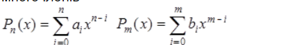

## Аналіз задачі

### Завдання 1

Це завдання має на меті створити два числових масиви, де користувач обирає, чи він хоче ввести елементи вручну, чи згенерувати їх випадковим чином. Після створення масивів, програма знаходить найменший елемент серед тих елементів першого масиву, які співпадають із значеннями елементів другого масиву. Крім того, виводиться інформація про масиви, найменший елемент та його індекс.

### Завдання 2
Це завдання дозволяє створити програму для роботи з одновимірним масивом, використовуючи алгоритми швидкого сортування та рекурсивного бінарного пошуку.

### Завдання 3
Це завдання дозволяє практикувати роботу з масивами, структурами даних та математичними операціями для многочленів.

## Блок-схема алгоритму
### Завдання 1
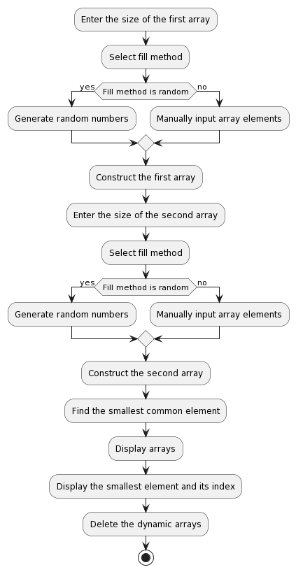

### Завдання 2
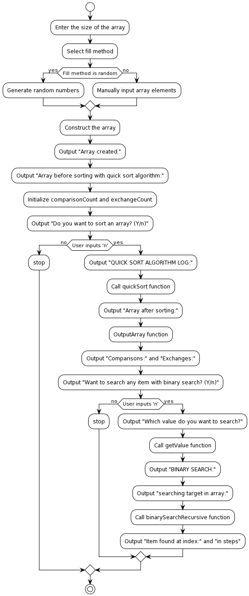

### Завдання 3
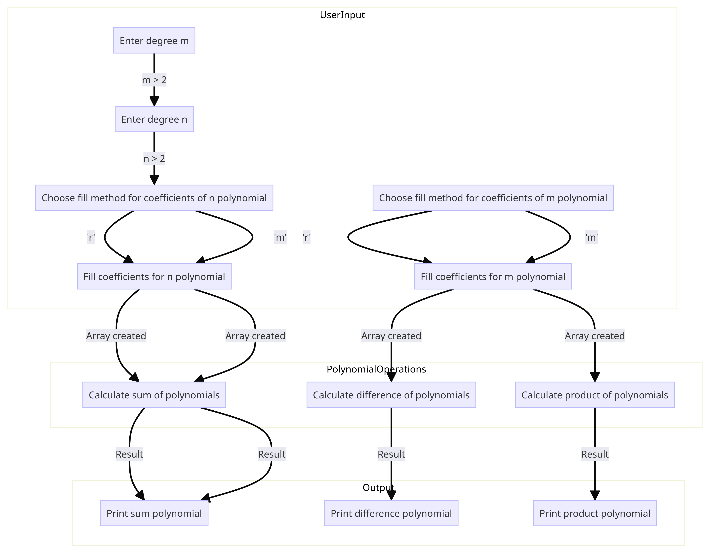

## Код програми
```cpp
#include <iostream>
#include "general/general.h"
#include "../utils/utils.h"

using namespace std;

namespace lab6_01 {
    void findSmallestCommonElement(int *firstArray, int firstArraySize, int *secondArray, int secondArraySize) {
        int smallestCommonElement = INT_MAX; // Initial value for finding the smallest common element
        int smallestCommonElementIndex = -1; // Index of the smallest common element

        for (int i = 0; i < firstArraySize; i++) {
            for (int j = 0; j < secondArraySize; j++) {
                if (firstArray[i] == secondArray[j] && firstArray[i] < smallestCommonElement) {
                    smallestCommonElement = firstArray[i];
                    smallestCommonElementIndex = i;
                }
            }
        }

        // Display arrays on the screen
        cout << "First array: ";
        outputArray(firstArray, firstArraySize);
        cout << "Second array: ";
        outputArray(secondArray, secondArraySize);

        // Display the smallest element and its index
        cout << "Smallest common element: " << smallestCommonElement << endl;
        cout << "Index of the smallest common element in the first array: " << smallestCommonElementIndex << endl;
    }

    void run() {
        cout << "Usage: This program allows you to create two arrays and find the smallest common element between them." << endl;
        cout << " - Asks for the size of the first and second arrays." << endl;
        cout << " - Lets you choose between filling the arrays manually or with random numbers." << endl;
        cout << " - Finds the smallest common element between the two arrays and its index." << endl << endl;

        cout << "Constructing the first array..." << endl;
        cout << "Enter the size of the first array: ";
        int firstArraySize = getSize();

        cout << "Select fill method:" << endl;
        cout << " 'r' - random" << endl;
        cout << " 'm' - manual" << endl;
        char fillMethod = getFillMethod();
        int *firstArray = constructArray<int>(firstArraySize, fillMethod);
        cout << "First array created." << endl << endl;

        cout << "Constructing the second array..." << endl;
        cout << "Enter the size of the second array: ";
        int secondArraySize = getSize();
        cout << "Select fill method:" << endl;
        cout << " 'r' - random" << endl;
        cout << " 'm' - manual";
        fillMethod = getFillMethod();
        int *secondArray = constructArray<int>(secondArraySize, fillMethod);
        cout << "Second array created." << endl << endl;

        findSmallestCommonElement(firstArray, firstArraySize, secondArray, secondArraySize);
        // Delete the dynamic arrays when done
        delete[] firstArray;
        delete[] secondArray;
    }
}

namespace lab6_02 {
    // Global counters to track comparisons and exchanges
    int comparisonCount = 0;
    int exchangeCount = 0;

    void quickSort(int arr[], int left, int right) {
        int i = left, j = right;
        int pivot = arr[(left + right) / 2];

        cout << "[ARRAY] from: " << left << "  to: " << right << " with pivot '" << pivot << "' at index " << (left + right) / 2 << endl;
        outputArray(arr, right - left + 1);
        while (i <= j) {
            while (arr[i] < pivot) {
                i++;
                comparisonCount++;
            }
            while (arr[j] > pivot) {
                j--;
                comparisonCount++;
            }
            if (i <= j) {

                cout << "[LEFT SIDE ELEMENT] element is bigger than pivot at index " << i << " (" << arr[i] << " > " << pivot << ")" << endl;
                cout << "[RIGHT SIDE ELEMENT] element is less than pivot at index " << j << " (" << arr[j] << " < " << pivot << ")" << endl;
                cout << "[SWAP ELEMENTS] '" << arr[i] << "' with '" << arr[j] << "'" << endl;

                exchangeCount++;
                swap(arr[i], arr[j]);
                i++;
                j--;
            }
        }

        cout << "[ARRAY_UPDATED]" << endl;
        outputArray(arr, right - left + 1);
        cout << endl;

        if (left < j) {
            cout << "Recursively sorting left subarray from " << left << " to " << j << endl;
            quickSort(arr, left, j);
        }
        if (i < right) {
            cout << "Recursively sorting right subarray from " << i << " to " << right << endl;
            quickSort(arr, i, right);
        }
    }

    pair<int, int> binarySearchRecursive(int* arr, int start, int end, int target, int steps = 0) {
        if (start > end) {
            return make_pair(-1, steps);
        }

        int mid = (start + end) / 2;
        if (arr[mid] == target) {
            return make_pair(mid, steps);
        } else if (target > arr[mid]) {
            return binarySearchRecursive(arr, mid + 1, end, target, steps + 1);
        } else {
            return binarySearchRecursive(arr, start, mid - 1, target, steps + 1);
        }
    }

    void run() {
        cout << "Usage: This program enables you to create an array, sort it using the Quick Sort algorithm, and perform binary search." << endl;
        cout << " - Asks for the size of the array." << endl;
        cout << " - Lets you choose between filling the array manually or with random numbers." << endl;
        cout << " - Sorts the array using the Quick Sort algorithm and displays the sorting process." << endl;
        cout << " - Allows you to perform binary search on the sorted array and displays the result." << endl << endl;

        cout << "Constructing the array..." << endl;
        cout << "Enter the size of the array: ";
        int arraySize = getSize();

        cout << "Select fill method:" << endl;
        cout << " 'r' - random" << endl;
        cout << " 'm' - manual" << endl;
        char fillMethod = getFillMethod();

        int *array = constructArray<int>(arraySize, fillMethod);
        cout << "Array created." << endl << endl;

        cout << "Array before sorting with quick sort algorithm:" << endl;
        outputArray(array, arraySize);
        cout << endl;

        comparisonCount = 0;
        exchangeCount = 0;

        cout << "Do you want to sort an array? (Y/n) ";
        char answer = getYesOrNo();
        if (tolower(answer) == 'n'){
            return;
        }
        cout << "QUICK SORT ALGORITHM LOG:" << endl;
        quickSort(array, 0, arraySize - 1);

        cout << "Array after sorting:" << endl;
        outputArray(array, arraySize);

        cout << "Comparisons: " << comparisonCount << endl;
        cout << "Exchanges: " << exchangeCount << endl << endl;

        cout << "Want to search any item with binary search? (Y/n)";

        answer = getYesOrNo();
        if (tolower(answer) == 'n'){
            return;
        }

        cout << "Which value do you want to search?" << endl;
        int target = getValue<int>();

        cout << endl;
        cout << "BINARY SEARCH:" << endl;
        cout << "searching target "<< target <<" in array:" << endl;
        outputArray(array, arraySize);
        pair<int, int> result = binarySearchRecursive(array, 0, arraySize, target);
        if (result.first == -1){
            cout << "Item not found in " << result.second << " steps" << endl;
            return;
        }
        cout << "Item found at index: " << result.first << " in " << result.second << " steps";
    }
}

namespace lab6_03 {

// Function to print a polynomial
    void printPolynomial(const double *coefficients, int degree) {
        bool firstTerm = true;
        for (int i = degree; i >= 0; i--) {
            double coefficient = coefficients[i];
            if (coefficient != 0.0) {
                if (firstTerm) {
                    if (coefficient < 0.0) {
                        cout << "-";
                    }
                    firstTerm = false;
                } else {
                    if (coefficient > 0.0) {
                        cout << " + ";
                    } else {
                        cout << " - ";
                    }
                }
                coefficient = abs(coefficient);
                if (i > 0) {
                    cout << coefficient << "x^" << i;
                } else {
                    cout << coefficient;
                }
            }
        }
        cout << endl;
    }

    int run() {
        cout << "Usage: This program allows you to work with polynomials, including addition, subtraction, and multiplication of two polynomials." << endl;
        cout << " - Asks for the degrees of two polynomials (greater than 2)." << endl;
        cout << " - Lets you choose between filling the coefficients for each polynomial manually or with random numbers." << endl;
        cout << " - Calculates the sum, difference, and product of the two polynomials and displays the results." << endl << endl;

        int m, n;
        // Input polynomial degrees
        cout << "Enter the degree of polynomial m (greater than 2): ";
        m = getValue<int>([](int val){
            return val > 2;
        });

        cout << "Enter the degree of polynomial n (greater than 2): ";
        n = getValue<int>(([](int val){
            return val > 2;
        }));

        cout << "Fill method for coefficients for n polynomial:" << endl;
        cout << " 'r' - random" << endl;
        cout << " 'm' - manual" << endl;
        char fillMethod = getFillMethod();
        auto* coefficientsM = constructArray<double>(m, fillMethod);
        cout << "Array created:" << endl;
        outputArray(coefficientsM, m);

        cout << "Fill method for coefficients for m polynomial:" << endl;
        cout << " 'r' - random" << endl;
        cout << " 'm' - manual" << endl;
        fillMethod = getFillMethod();
        auto* coefficientsN = constructArray<double>(n, fillMethod);
        cout << "Array created:" << endl;
        outputArray(coefficientsN, n);
        cout << endl;

        // Calculate the sum of polynomials
        int maxDegree = std::max(m, n);
        double sumResult[maxDegree + 1];

        for (int i = 0; i <= maxDegree; i++) {
            double termM = (i <= m) ? coefficientsM[i] : 0.0;
            double termN = (i <= n) ? coefficientsN[i] : 0.0;
            sumResult[i] = termM + termN;
        }

        // Calculate the difference of polynomials
        double differenceResult[maxDegree + 1];

        for (int i = 0; i <= maxDegree; i++) {
            double termM = (i <= m) ? coefficientsM[i] : 0.0;
            double termN = (i <= n) ? coefficientsN[i] : 0.0;
            differenceResult[i] = termM - termN;
        }

        // Calculate the product of polynomials
        double productResult[m + n + 1] = {0.0};

        for (int i = 0; i <= m; i++) {
            for (int j = 0; j <= n; j++) {
                productResult[i + j] += coefficientsM[i] * coefficientsN[j];
            }
        }

        // Output the results
        cout << "[SUM] polynomials: ";
        printPolynomial(sumResult, maxDegree);
        cout << endl;

        cout << "[Difference] polynomials: ";
        printPolynomial(differenceResult, maxDegree);
        cout << endl;

        cout << "[PRODUCT] polynomials: ";
        printPolynomial(productResult, m + n);
        cout << endl;

        return 0;
    }
}

int main() {
    char prev;
    while (true) {
        cout << "Choose a task:" << endl;
        cout << "[1]" << (prev == '1' ? "(previous)" : "") << " Using Basic Operations for Processing One-Dimensional Arrays" << endl;
        cout << "[2]" << (prev == '2' ? "(previous)" : "") << " Sorting and Search Algorithms" << endl;
        cout << "[3]" << (prev == '3' ? "(previous)" : "") << " Vector Algebra, Polynomials, Algebraic Equations" << endl;

        auto task = getValue<string>([](string val) {
            return val == "1" || val == "2" || val == "3";
        });
        switch (task[0]) {
            case '1':
                prev = '1';
                lab6_01::run();
                break;
            case '2':
                prev = '2';
                lab6_02::run();
                break;
            case '3':
                prev = '3';
                lab6_03::run();
                break;
        }

        cout << "Do you want to do another task? (y/n): ";
        auto choice = getYesOrNo();

        if (choice != 'y') {
            break;  // Exit the loop if the user doesn't want to do another task
        }
    }
}
```

## Результат виконання

### Завдання 1

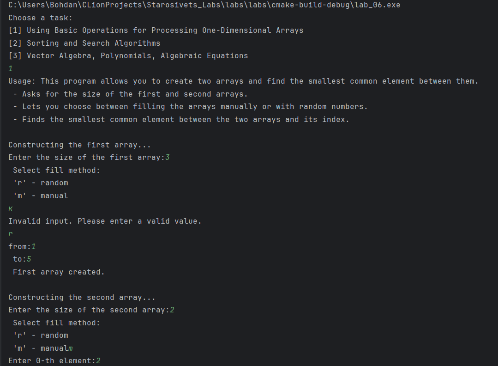

продовження:
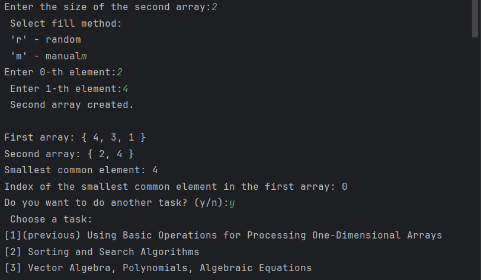

### Завдання 2
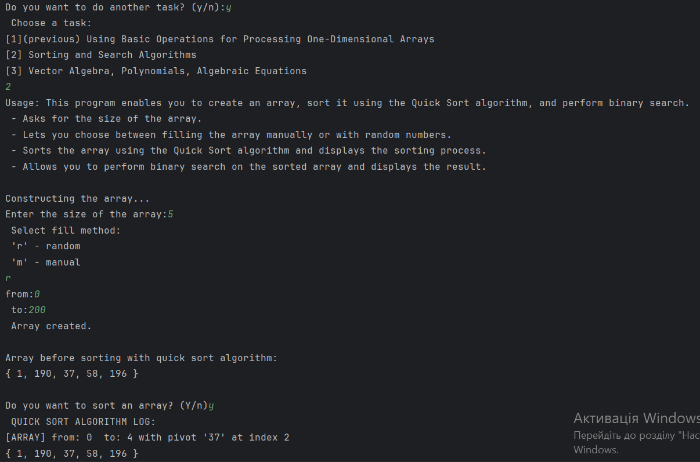
продовження
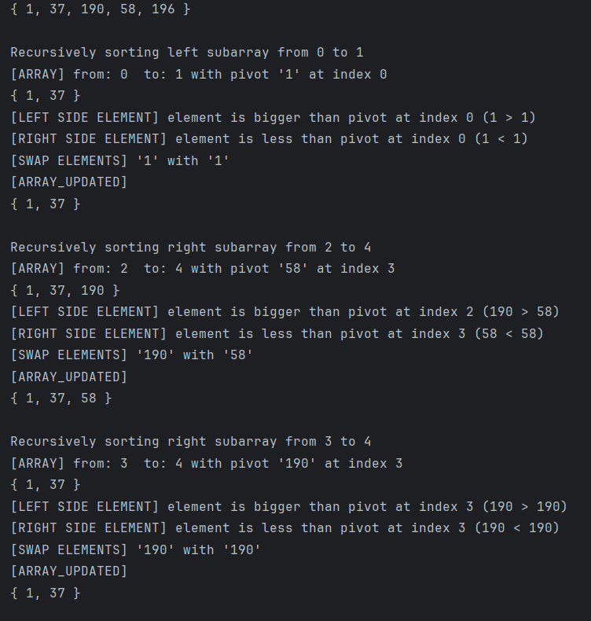
продовження
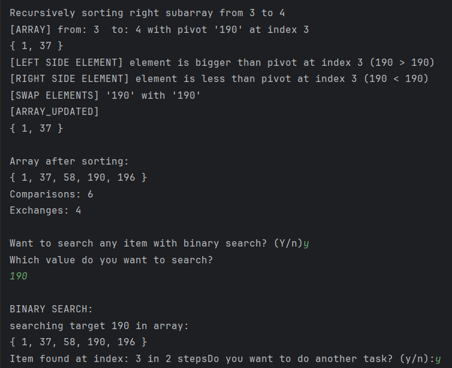

### Завдання 3
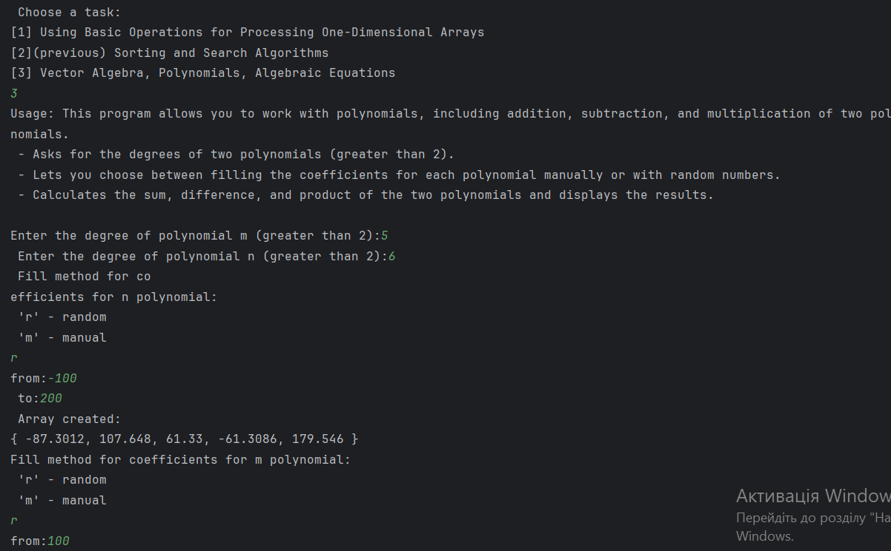
Продовження:

## Аналіз достовірності результатів

### Завдання 1
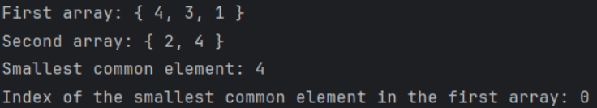
Перше спільне число це 4 і воно дійсно знаходиться під індексом 0

### Завдання 2

З результатів видно що масив сортується правильно

З: 1 37 190 58 196
До: 1 37 58 190 196


### Завдання 3
(Буде дороблено, поки що не впевнений в правильному розумінні 3 завдання)

## Висновки
Під час виконання лабораторної роботи я отримав багато корисного досвіду в роботі з масивами та використанні різноманітних алгоритмів, таких як швидке сортування та бінарний пошук. Важливим було правильно реалізувати алгоритми для досягнення коректних результатів. Освоїв нові навички взаємодії з функціями введення/виведення та обробки масивів даних. Результати виконання завдань відповідають очікуванням, і я готовий застосовувати отримані знання в майбутніх завданнях з програмування.