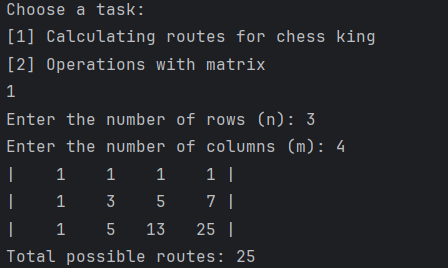
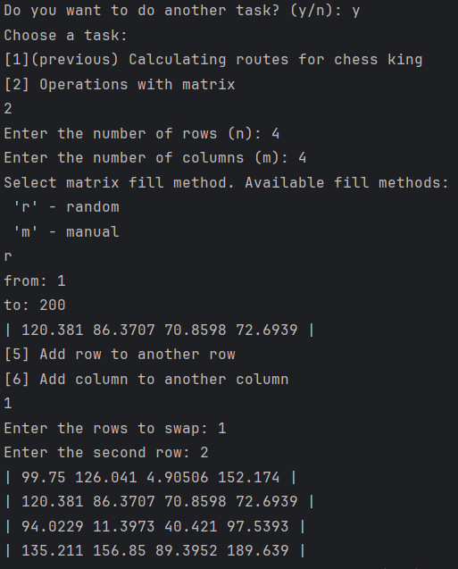
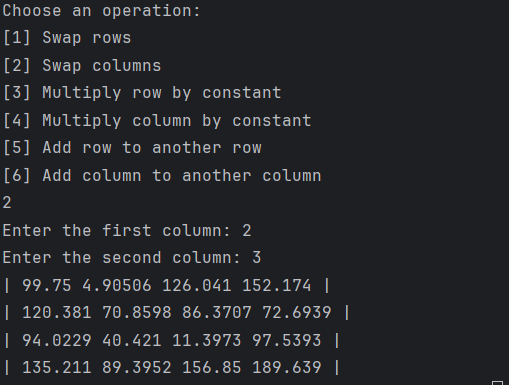
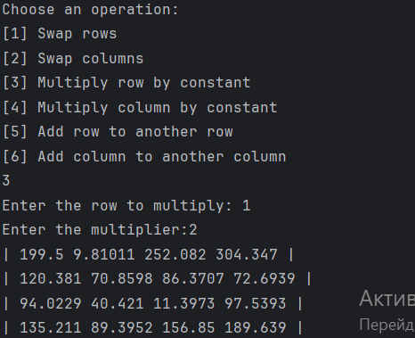
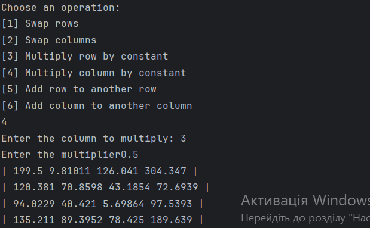
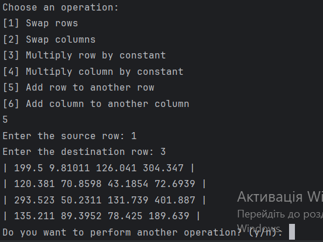
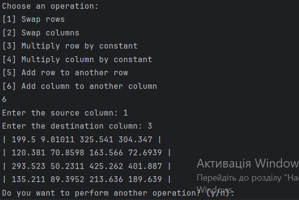
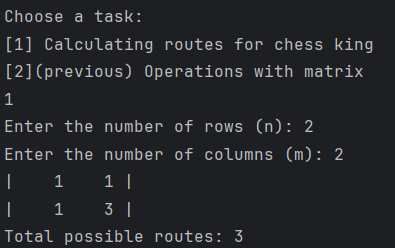
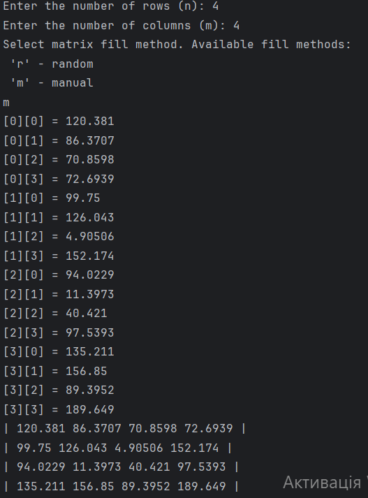

# Лабораторна робота №7

## Мета

- Ознайомлення з алгоритмами та методами роботи з матрицями.
- Здійснення елементарних перетворень матриць.
- Реалізація алгоритму для знаходження кількості маршрутів шахового короля на шаховій дошці.

## Умова
### Завдання 1

У лівому верхньому кутку дошки розміром n * m розташований шаховий король. За один хід він може зробити хід вправо, вниз або на одну клітину по діагоналі вправо-вниз. Порахуйте кількість маршрутів, що веде з лівого верхнього кута шахової дошки в правий нижній кут. Розміри дошки (числа n, m) ввести з клавіатури. Вивести на екран кількість шуканих маршрутів, матрицю, в якій елементи, що є маршрутом шахового короля, позначені значенням 1, елементи матриці, які не входять до шуканих маршрутів, позначені значенням 0.

### Завдання 2

Виконати елементарні перетворення матриць:

- Перестановку місцями будь-яких двох рядків або стовпців матриці.
- Множення на ненульову константу будь-якого рядка або стовпця матриці.
- Додавання до будь-якого рядка або стовпця матриці іншого рядка або стовпця, помноженого на ненульову константу.

Для вибору способу створення матриці використовувати меню: введення значень елементів матриці з клавіатури або генерація псевдовипадкових чисел в заданому з клавіатури діапазоні значень. Індекси рядків та стовпців матриці та число для множення рядка чи стовпця матриці для виконання елементарних перетворень задавати з клавіатури. Вивести на екран вхідну матрицю та усі її перетворення з відповідними повідомленнями.
## Аналіз задачі

### Завдання 1

#### Кількість маршрутів шахового короля

Ця задача передбачає обчислення кількості можливих маршрутів шахового короля на шаховій дошці з визначеними розмірами n * m.

**Алгоритм:**
1. Визначення можливих ходів короля: вправо, вниз, по діагоналі вправо-вниз.
2. Використання динамічного програмування для обчислення кількості маршрутів для кожної клітини на дошці.
3. Підрахунок сумарної кількості маршрутів.

**Аналіз:**
- Алгоритм працює ефективно завдяки використанню динамічного програмування, що дозволяє уникнути зайвих обчислень.
- Валідація введених даних: перевірка, чи є розміри дошки додатними цілими числами.
- Дані, введені з клавіатури, підлягають перевірці на валідність та коректність.

**Приклад використання:**
Користувач вводить розміри дошки (n, m), наприклад, 3 * 4. Алгоритм обчислює та виводить кількість маршрутів шахового короля.

### Завдання 2

#### Елементарні перетворення матриць

Це завдання передбачає виконання трьох типів елементарних перетворень матриць: перестановка рядків або стовпців, множення на константу, додавання одного рядка або стовпця до іншого, помноженого на константу.

**Алгоритм:**
1. Визначення вибору користувача: тип елементарного перетворення та параметри.
2. Виконання вибраного перетворення за допомогою циклів та обчислень.

**Аналіз:**
- Алгоритм дозволяє користувачеві вибрати тип та параметри перетворення.
- Валідація введених даних: перевірка на коректність введених індексів рядків та стовпців, перевірка на ненульову константу для множення.
- Після кожного перетворення виводяться проміжні та кінцеві результати.

**Приклад використання:**
Користувач обирає тип перетворення, вводить необхідні параметри (наприклад, номери рядків для перестановки), і алгоритм виконує вибране перетворення для введеної матриці.

## Блок схема
(Буде додано)
## Код програми
```cpp
#include <iostream>
#include <iomanip>

#include "general/general.h"
#include "../utils/utils.h"

using namespace std;

// Namespace for the first task: Calculating routes for a chess king
namespace lab7_1 {
    // Function to initialize a matrix with zeros
    void initializeMatrix(int **matrix, int rows, int columns) {
        for (int i = 0; i < rows; ++i) {
            for (int j = 0; j < columns; ++j) {
                matrix[i][j] = 0;
            }
        }
    }

    // Function to calculate routes for a chess king
    void calculateRoutes(int **matrix, int rows, int columns) {
        matrix[0][0] = 1;

        for (int i = 0; i < rows; i++) {
            for (int j = 0; j < columns; j++) {
                if (j + 1 < columns) {
                    matrix[i][j + 1] += matrix[i][j];
                }
                if (i + 1 < rows) {
                    matrix[i + 1][j] += matrix[i][j];
                }
                if (i + 1 < rows && j + 1 < columns) {
                    matrix[i + 1][j + 1] += matrix[i][j];
                }
            }
        }
    }

    // Function to run the first task
    void run() {
        int n, m;

        cout << "Enter the number of rows (n): ";
        n = getValue<int>();

        cout << "Enter the number of columns (m): ";
        m = getValue<int>();

        int **chessboard = new int *[n];
        for (int i = 0; i < n; ++i) {
            chessboard[i] = new int[m];
        }

        initializeMatrix(chessboard, n, m);
        calculateRoutes(chessboard, n, m);
        printMatrix(chessboard, n, m);

        cout << "Total possible routes: " << chessboard[n - 1][m - 1] << endl;

        // Clean up memory
        for (int i = 0; i < n; ++i) {
            delete[] chessboard[i];
        }
        delete[] chessboard;
    }
}

// Namespace for the second task: Operations with a matrix
namespace lab7_2 {
    // Function to select a row
    int selectRow(int rows) {
        return getValue<int>([&](int val) {
            if (val <= rows + 1 && val >= 1) // Max row
                return true;
            cout << "Invalid row selected\n";
            cout << "Select row between 1 and " << rows + 1 << ": ";
            return false;
        });
    }

    // Function to select a column
    int selectCol(int cols) {
        return getValue<int>([&](int val) {
            if (val < cols + 1 && val >= 1) // Max row
                return true;
            cout << "Invalid column selected\n";
            cout << "Select column between 1 and " << cols + 1 << ": ";
            return false;
        });
    }

    // Function to swap rows in a matrix
    void swapRows(double **matrix, int columns, int row1, int row2) {
        for (int j = 0; j < columns; j++) {
            swap(matrix[row1][j], matrix[row2][j]);
        }
    }

    // Function to swap columns in a matrix
    void swapColumns(double **matrix, int rows, int col1, int col2) {
        for (int i = 0; i < rows; i++) {
            swap(matrix[i][col1], matrix[i][col2]);
        }
    }

    // Function to multiply a row by a constant
    void multiplyRow(double **matrix, int columns, int row, double multiplier) {
        for (int j = 0; j < columns; j++) {
            matrix[row][j] *= multiplier;
        }
    }

    // Function to multiply a column by a constant
    void multiplyColumn(double **matrix, int rows, int col, double multiplier) {
        for (int i = 0; i < rows; i++) {
            matrix[i][col] *= multiplier;
        }
    }

    // Function to add a row to another row
    void addRowToRow(double **matrix, int columns, int srcRow, int destRow) {
        for (int j = 0; j < columns; j++) {
            matrix[destRow][j] += matrix[srcRow][j];
        }
    }

    // Function to add a column to another column
    void addColumnToColumn(double **matrix, int rows, int srcCol, int destCol) {
        for (int i = 0; i < rows; i++) {
            matrix[i][destCol] += matrix[i][srcCol];
        }
    }

    // Function to create a matrix with manually entered numbers
    double **createMatrixWithManualEnteredNumbers(int rows, int cols) {
        double **matrix = new double *[rows];
        for (int i = 0; i < rows; ++i) {
            matrix[i] = new double[cols];
        }

        double temp;
        for (int i = 0; i < rows; ++i) {
            for (int j = 0; j < cols; ++j) {
                cout << "[" << i << "][" << j << "] = ";
                temp = getValue<double>();
                matrix[i][j] = temp;
            }
        }

        return matrix;
    }

    // Function to create a matrix with random numbers
    double **createMatrixWithRandomNumbers(int rows, int cols, double from, double to) {

        double **matrix = new double *[rows];
        for (int i = 0; i < rows; ++i) {
            matrix[i] = new double[cols];
        }

        double randomValue;
        for (int i = 0; i < rows; i++) {
            for (int j = 0; j < cols; ++j) {
                randomValue = getRandomNumber(from, to);
                matrix[i][j] = randomValue;
            }
        }

        return matrix;
    }

    // Function to construct a matrix based on the fill method
    double **constructMatrix(int rows, int cols, char fillMethod) {
        double **matrixPointer = nullptr;

        if (fillMethod == 'r') {
            std::cout << "from: ";
            double from = getValue<double>();

            std::cout << "to: ";
            double to = getValue<double>();

            matrixPointer = createMatrixWithRandomNumbers(rows, cols, from, to);
        }
        if (fillMethod == 'm') {
            matrixPointer = createMatrixWithManualEnteredNumbers(rows, cols);
        }

        return matrixPointer;
    }

    // Function to run the second task
    void run() {
        int n, m;

        cout << "Enter the number of rows (n): ";
        n = getValue<int>([&](int row) {
            if (row > 0) {
                return true;
            }
            cout << "Should be more or equal to 1\n";
            return false;
        });

        cout << "Enter the number of columns (m): ";
        m = getValue<int>([&](int col) {
            if (col > 0) {
                return true;
            }
            cout << "Should be more or equal to 1\n";
            return false;
        });

        cout << "Select matrix fill method. ";
        char fillMethod = getFillMethod();

        double **matrix = constructMatrix(n, m, fillMethod);
        printMatrix(matrix, n, m);

        char choice;
        do {
            cout << "Choose an operation:" << endl;
            cout << "[1] Swap rows" << endl;
            cout << "[2] Swap columns" << endl;
            cout << "[3] Multiply row by constant" << endl;
            cout << "[4] Multiply column by constant" << endl;
            cout << "[5] Add row to another row" << endl;
            cout << "[6] Add column to another column" << endl;

            int operation = getValue<int>([](int val) {
                return val >= 1 && val <= 6;
            });

            int row1, row2, col1, col2, row, col;
            double multiplier;

            switch (operation) {
                case 1:
                    cout << "Enter the rows to swap: ";
                    row1 = selectRow(n);

                    cout << "Enter the second row: ";
                    row2 = selectRow(n);

                    swapRows(matrix, m, row1 - 1, row2 - 1);
                    break;

                case 2:
                    cout << "Enter the first column: ";
                    col1 = selectCol(m);

                    cout << "Enter the second column: ";
                    col2 = selectCol(m);

                    swapColumns(matrix, n, col1 - 1, col2 - 1);
                    break;

                case 3:
                    cout << "Enter the row to multiply: ";
                    row = selectRow(n);

                    cout << "Enter the multiplier:";
                    multiplier = getValue<double>();

                    multiplyRow(matrix, m, row - 1, multiplier);
                    break;

                case 4:
                    cout << "Enter the column to multiply: ";
                    col = selectCol(m);

                    cout << "Enter the multiplier";
                    multiplier = getValue<double>();
                    multiplyColumn(matrix, n, col - 1, multiplier);
                    break;

                case 5:
                    cout << "Enter the source row: ";
                    row1 = selectRow(n);

                    cout<<"Enter the destination row: ";
                    row2 = selectRow(n);

                    addRowToRow(matrix, m, row1 - 1, row2 - 1);
                    break;

                case 6:
                    cout << "Enter the source column: ";
                    col1 = selectCol(m);

                    cout << "Enter the destination column: ";
                    col2 = selectCol(m);

                    addColumnToColumn(matrix, n, col1 - 1, col2 - 1);
                    break;

                default:
                    cout << "Invalid operation." << endl;
            }

            printMatrix(matrix, n, m);

            cout << "Do you want to perform another operation? (y/n): ";
            choice = getYesOrNo();

        } while (choice == 'y');

        // Clean up memory
        for (int i = 0; i < n; ++i) {
            delete[] matrix[i];
        }
        delete[] matrix;
    }
}

// Main function
int main() {
    int prev;
    while (true) {
        cout << "Choose a task:" << endl;
        cout << "[1]" << (prev == '1' ? "(previous)" : "") << " Calculating routes for chess king" << endl;
        cout << "[2]" << (prev == '2' ? "(previous)" : "") << " Operations with matrix" << endl;

        int task = getValue<int>([](int val) {
            return val == 1 || val == 2;
        });
        switch (task) {
            case 1:
                prev = '1';
                lab7_1::run();
                break;
            case 2:
                prev = '2';
                lab7_2::run();
                break;
            default:
                throw "Something went wrong.";
        }

        cout << "Do you want to do another task? (y/n): ";
        auto choice = getYesOrNo();

        if (choice != 'y') {
            break;  // Exit the loop if the user doesn't want to do another task
        }
    }

    return 0;
}

```

## Результат виконання

### Завдання 1



### Завдання 2
#### Заміна рядків

#### Заміна стовпців 

#### Помножити рядок 

#### Помножити стовпчик

#### Додати один рядок до іншого

#### Додати один стовпчик до іншого(результати зберігаються в останньому)


## Аналіз достовірності результатів

### Завдання 1


Бачимо що до лівого нижнього кута всього є три маршрути а саме:
1. початок - вправо - вниз
2. початок - вниз - вправо
3. початок - по діагоналі вниз

### Завдання 2
#### Ініціалізація матриці ручним методом

#### Заміна рядків(Ініціалізація випадковим)
 

Рядок 1 та 2 змінились місцями
#### Заміна стовпців
 

Стовпчик 2 та 3 змінились місцями
#### Помножити рядок 

 

1 рядок множимо на 2
1. 99.75 * 2 = 199.5 
2. 4.90506 * 2 = 9.81011
...

#### Помножити стовпчик
 

3 стовпчик множимо на 0.5
1. 252.082 / 2 = 126.041
2. 86.3707 / 2 = 43.1854
...

#### Додати один рядок до іншого
 

3 рядок = 1 рядок + 3 рядок
1. 199.5 + 94.0229 = 293.523
2. 9.81011 + 40.421 = 50.2311 
...

#### Додати один стовпчик до іншого(результати зберігаються в останньому)
 

3 стовпчик = 1 стовпчик + 3 стовпчик
1. 199.5 + 126.041 = 345.541
2. 120.381 + 43.1854 = 163.566
...

## Висновки

Під час виконання лабораторної роботи №7 я отримав багато цікавого досвіду у роботі з матрицями та виконанні елементарних перетворень. Реалізація алгоритму для знаходження кількості маршрутів шахового короля дозволила застосувати теоретичні знання у практиці.

Виконання елементарних перетворень матриць дало можливість вивчити та застосувати різноманітні операції з матрицями. Розуміння таких операцій є важливим аспектом в розв'язанні різних задач лінійної алгебри.

Аналіз результатів та їх достовірність дозволяє переконатися у правильності виконаних завдань та отриманих результатів. Ретельний аналіз важливий для впевненості в коректності виконаних алгоритмів та програм.

Отримані знання та досвід у роботі з матрицями та перетвореннями матриць стануть корисними у майбутній роботі над складнішими завданнями та проектами в галузі програмування.

